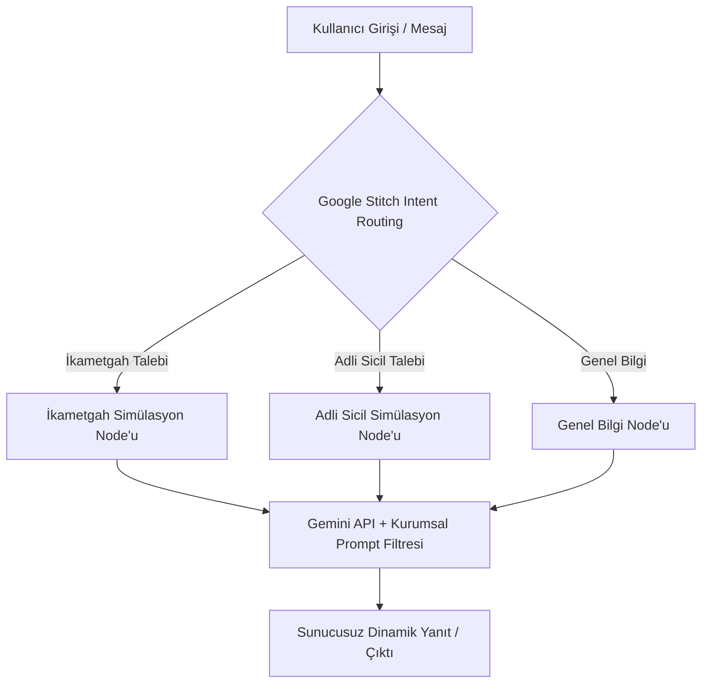

# e-Devlet-Entegre-Chatbot-projesi

> **Kamu hizmetlerinde yapay zeka dönemi:** Geleneksel backend süreçlerini geride bırakarak, Google'ın yeni nesil düğüm tabanlı mimarisiyle inşa edilmiş inovatif bir e-Devlet asistan simülasyonu.

<!-- Badges -->

Bu proje; vatandaşların kamu hizmetlerine doğal dil işleme (NLP) desteğiyle, hızlı ve interaktif bir şekilde erişebilmesini hedefleyen akıllı bir chatbot prototipidir. 

Klasik sunucu kurulumları ve karmaşık kod blokları yerine, **Google Stitch** platformunun görsel ve mantıksal akış (node-based) mimarisi kullanılarak, **Google Gemini API** entegrasyonu tamamen sunucusuz (serverless) ve optimize bir şekilde gerçekleştirilmiştir.

🔗 **Canlı Önizleme:** [Google Stitch - Proje Önizlemesi](#) *(Buraya gerçek linki ekleyebilirsiniz)*

---

## ✨ Öne Çıkan Özellikler

* **Google Stitch Mimarisi:** Herhangi bir sunucu kurulumu veya karmaşık backend mimarisi gerekmeden; görsel düğümler (nodes) ve mantıksal akışlar (flows) üzerinden inşa edilen yeni nesil altyapı.
* **Doğal Dil Anlama (NLU):** Google Gemini API entegrasyonu sayesinde kullanıcı niyetini (intent) ve e-Devlet servis taleplerini anlık olarak yüksek doğrulukla analiz etme yeteneği.
* **e-Devlet Servis Simülasyonları:** Sık kullanılan kamu hizmetlerinin (Adli sicil kaydı sorgulama, ikametgah doğrulama, vergi borcu yapılandırma vb.) chatbot üzerinden interaktif ve akıllı simülasyonu.
* **Gelişmiş Prompt Mühendisliği:** Yapay zekanın resmi, kurumsal, güvenilir ve yardımcı bir e-Devlet asistanı rolünü tutarlı, manipülasyonlara kapalı ve profesyonel bir üslupla sürdürmesini sağlayan sistem talimatları.

---

## 🛠️ Kullanılan Teknolojiler

| Bileşen | Teknoloji / Araç | Kullanım Amacı |
| :--- | :--- | :--- |
| **Geliştirme Altyapısı** | Google Stitch | Düğüm tabanlı GenAI Prototipleme Platformu |
| **Yapay Zeka Modeli** | Google Gemini API | Doğal Dil İşleme ve Dinamik Yanıt Üretimi |
| **Mantıksal Akış** | Stitch Conditional Nodes | Kullanıcı Niyetine Göre (Intent) Yönlendirme |
| **Entegrasyon** | API Endpoints & Prompt Nodes | Veri Giriş/Çıkış Kontrolü ve Prompt Yönetimi |

---

## 🏗️ Çalışma Mantığı ve İş Akışı (Workflow)

1. Giriş (User Input): Kullanıcı, arayüz veya test paneli üzerinden chatbot'a doğal dilde bir mesaj gönderir.

2. Niyet Analizi (Intent Routing): Google Stitch üzerindeki koşullu yönlendirici düğümler (conditional nodes), kullanıcının hangi e-Devlet hizmetini simüle etmek istediğini algılar.

3. Yapay Zeka İşleme (AI Processing): Prompt düğümleri aracılığıyla istek Gemini API'ye aktarılır. Sistem talimatlarında belirlenen kurumsal dil kurallarına göre işlenir.

4. Yanıt (Output): Üretilen dinamik, yönlendirici ve resmi cevap sunucusuz bir şekilde anında kullanıcı ekranına yansıtılır.

🔒 Güvenlik ve Gizlilik Notu
⚠️ Önemli Bilgilendirme: Bu proje tamamen akademik ve portfolyo amaçlı geliştirilmiş bir simülasyon/arayüz çalışmasıdır. Kullanıcıların gerçek T.C. Kimlik Numarası, e-Devlet şifresi veya herhangi bir kişisel verisi (KVKK kapsamında) kesinlikle talep edilmez, kaydedilmez veya işlenmez. Tüm akış ve kimlik doğrulama adımları mock (test) verileriyle simüle edilmiştir.
